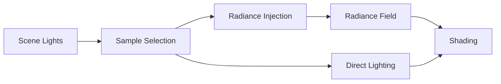

# Hierarchical Light–Field Sampling for Real-Time Rendering

## Abstract

Real-time rendering often struggles to scale with the number of lights and indirect bounces. Two complementary approaches have emerged: importance-sampled direct lighting and hierarchical radiance fields. Direct sampling allows efficient evaluation of many lights per pixel, while radiance fields store and reuse lighting information across space and direction.

Hierarchical Light–Field Sampling (HLFS) combines these into a single framework. Direct samples provide high-frequency detail, while the radiance field captures low-frequency illumination. This approach keeps per-pixel cost constant and allows scenes with many lights to be rendered efficiently.

---

## 1. Introduction

The rendering equation defines outgoing light at a point as an integral over all incoming directions:

```math
L_o(x, \omega_o) = \int_{\Omega} f_r(x, \omega_i, \omega_o)\, L_i(x, \omega_i)\, (\omega_i \cdot n)\, d\omega_i
```

Evaluating this integral directly is prohibitively expensive for real-time applications. The cost grows with the number of lights, geometry, and indirect bounces. Traditional solutions involve baking lighting, limiting dynamic lights, or approximating indirect illumination.

Modern approaches instead ask: can we **approximate the integral efficiently** by exploiting coherence in both the light and spatial domains? HLFS addresses this by combining sparse direct light sampling with a hierarchical representation of incoming radiance.

---

## 2. Sparse Direct Light Sampling

In many scenes, only a small subset of lights contributes significantly at any given point. Rather than summing over all lights:

```math
L_{\text{direct}} = \sum_{i=1}^{N} L_i
```

we can sample a subset ( K \ll N ) of lights and weight their contributions:

```math
L_{\text{direct}} \approx \frac{1}{K} \sum_{j=1}^{K} \frac{L_{s_j}}{p(s_j)}
```

where ( p(s_j) ) is the probability of selecting light ( s_j ). This method reduces variance by focusing computation on the lights that matter most. Temporal and spatial reuse of samples further improves stability and efficiency.

---

## 3. Hierarchical Radiance Fields

Direct lighting captures high-frequency effects like shadows and highlights, but it does not provide information about indirect illumination. Radiance fields approximate the incoming light function:

```math
L_i(x, \omega) \approx \hat{L}_i(x, \omega)
```

A hierarchical structure allows different resolutions depending on distance and angular importance. Fine spatial resolution is maintained near surfaces, while coarser grids suffice for distant regions. This enables reuse of computed radiance across many pixels and frames, reducing computation without discarding indirect effects.

---

## 4. Combining Direct and Indirect Components

HLFS treats lighting as two layers: direct samples provide detailed, localized contributions, while the radiance field captures broader illumination. The shading equation becomes:

```math
L(x) = L_{\text{direct}}(x) + L_{\text{radiance}}(x)
```

By injecting direct light contributions into the radiance field, the system maintains a single coherent representation of scene lighting. This avoids duplicating work and allows both high-frequency and low-frequency effects to coexist naturally.

---

## 5. Pipeline Overview



Direct samples are used immediately for shading and also update the radiance field. Subsequent frames and neighboring pixels can query the field for indirect lighting, reducing redundant computation.

---

## 6. Feedback Between Sampling and Field

HLFS includes a feedback loop: the radiance field informs which lights to prioritize for sampling in future frames. This focuses computation where it is most likely to affect the final image:


Over time, the system becomes more efficient, sampling lights that contribute the most to illumination in each area.

---

## 7. Implementation Considerations

* **Radiance Data Structure:** Cascaded grids, probe volumes, or sparse voxel hierarchies can store radiance efficiently.
* **Temporal Reuse:** Maintaining a history of radiance and light samples reduces flicker.
* **Fixed Budget:** Limit the number of direct samples ( K ) and radiance queries ( M ) to ensure predictable performance:

```math
L_o \approx \frac{1}{K} \sum_{j=1}^{K} \frac{L_{s_j}}{p(s_j)} + \frac{1}{M} \sum_{k=1}^{M} \hat{L}_i(\omega_k)
```

* **Memory vs Accuracy:** Larger radiance fields reduce approximation error but increase memory footprint.

---

## 8. Advantages

HLFS provides:

* **Scalability:** Per-pixel cost does not depend on the total number of lights.
* **Coherence:** Radiance fields improve temporal and spatial stability.
* **Detail Preservation:** Direct samples retain high-frequency features.
* **Unified Mental Model:** Lighting is represented as a single field with layered detail.

---

## 9. Limitations

* High-frequency indirect effects, like caustics, may require additional handling.
* The feedback loop must be tuned to prevent bias or instability.
* Large or dynamic scenes may require significant memory for radiance structures.

---

## 10. In Summary

Hierarchical Light–Field Sampling provides a clear framework for combining sparse direct light sampling with hierarchical radiance fields. It simplifies reasoning about lighting, scales efficiently to many lights, and allows both high-frequency and low-frequency effects to be captured within a fixed computational budget.

By representing all light in a single field and layering detail, HLFS offers a practical and principled approach to real-time rendering in complex scenes.

