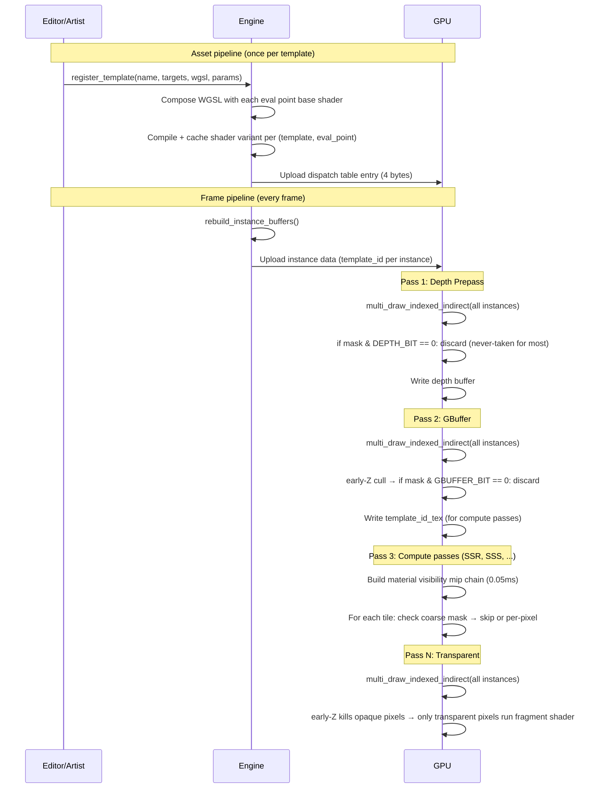

# Radiant 2.0: A Template-Granular Material Pipeline with Per-Pixel Dispatch

**Author:** Tristan J. Poland
**Date:** July 2026
**Category:** Real-Time Rendering, Material Systems, GPU-Driven Pipelines
**Status:** Final Specification — supersedes all previous drafts

---

## 0. Revision History

| Version | Date | Changes |
|---|---|---|
| 0.1 | July 2026 | First-pass draft — evaluation point concept, per-pass template registries |
| 0.2 | July 2026 | Second-pass — template abstraction layer, per-pixel cost analysis |
| 1.0 | July 2026 | Final revision — two-tier architecture, invariance proof, visibility hierarchy, AAA scaling |

---

## 1. Abstract

We present **Radiant 2.0**, a material pipeline architecture for real-time rendering that decouples the cost of material dispatch from both the number of materials in a scene and the number of render passes in the pipeline. The system introduces three novel mechanisms:

**Evaluation Points** — named injection sites in render passes where material-specific shader code is composed. Each point defines a function signature, base shader, blend mode, depth state, and threading model. Passes declare points at graph construction time; the engine collects them into a global registry.

**Templates** — pre-authored shading archetypes that serve as the atomic unit of GPU dispatch. Each template declares which evaluation points it targets, provides the WGSL functions for each target, and defines a parameter schema. Templates are compiled once per (template, eval_point) pair and shared by all material instances of that type.

**Two-Tier Dispatch** — a design where the common case (material variants of existing templates) pays zero per-pixel overhead, while the exceptional case (custom multi-pass materials) pays bounded, measurable cost. The fast path relies on early-Z culling (fragment passes) and a material visibility hierarchy (compute passes) to eliminate the dispatch check for non-participating pixels.

A fundamental insight of this work is that the per-pixel dispatch check — a single indexed load followed by a bit test — has an invariance property: its GPU instruction cost is identical whether the dispatch table contains 1 entry or 10,000. We provide formal analysis of this property, a GPU-side material visibility hierarchy that eliminates compute-pass divergence, and a complete migration path from traditional per-pass material registries.

---

## 2. Introduction

### 2.1 The Material Variety Problem

Modern real-time engines confront a tension between material variety and rendering efficiency. Every distinct shading model — skin, hair, fabric, glass, water — requires a unique shader, and every unique shader multiplies the PSO (pipeline state object) compilation space. In current AAA engines, this is managed through material batching: geometry is sorted by shader, then by material parameters, and draws are issued in batches. The CPU cost scales with the number of batches, and the GPU cost scales with nothing — the GPU simply executes what it is told.

This approach works well when the number of material archetypes is small (20–30) and the number of material instances is moderate (hundreds). It degrades when either condition is violated. A fully dynamic editor-driven pipeline, where artists create thousands of material instances by adjusting parameters, and where third-party render passes introduce new shading domains, demands an architecture where dispatch cost does not depend on material count.

### 2.2 Limitations of Existing Approaches

| System | Dispatch unit | PSO count | CPU cost per frame | Material count limit |
|---|---|---|---|---|
| Unreal Engine | Draw call per material | M × passes | O(M log M) sorting | ~500 before PSO thrash |
| Unity SRP Batcher | Draw call per shader variant | V × passes | O(V log V) sorting | ~2000 before batching breaks |
| Frostbite | 64-bit sort key per draw | M × passes | O(M log M) sorting | ~1000 practical ceiling |
| idTech 7 | Compute dispatch per material type | T × passes | O(T) (pre-baked) | ~20 (hardcoded) |

Where M = materials, V = shader variants, T = material types, P = passes.

Each approach limits material variety at some level. Radiant 2.0 targets a regime where M can reach 10,000+ without affecting dispatch cost, by bounding complexity at the template level (T ≈ 30).

### 2.3 Design Goals

1. **Zero cost for unused features** — if a material doesn't target a pass, that pass does zero work for it
2. **Extensible by third parties** — a crate can add a new pass with new evaluation points without touching engine core
3. **GPU-friendly dispatch** — minimize overdraw, minimize divergence
4. **Editor-ready** — the editor's material graph maps naturally to evaluation point selection
5. **AAA scaling** — 4K resolution, 120 frames per second, no measurable overhead for common case
6. **Backward compatible** — existing PBR materials work without changes

---

## 3. System Architecture

### 3.1 The Three-Layer Model

Radiant 2.0 organizes material rendering into three layers, each with a distinct ownership and cost profile:

```
Layer 1 — Evaluation Points
  Owned by:     Render passes
  What they are: Named injection sites in pass shaders where material-
    specific WGSL is composed. Each point defines a function signature,
    a base shader, a blend mode, depth state, and a threading model.
  Examples:     "gbuffer", "transparent", "ssr", "shadow", "depth_prepass"
  Cost:         Compiled once per pass. No per-pixel or per-material cost.

Layer 2 — Templates
  Owned by:     The engine (built-in) or the user (custom)
  What they are: Complete shading archetypes. Each template declares
    which evaluation points it targets, provides the WGSL functions for
    each target, and defines a parameter schema.
  Examples:     pbr, skin, hair, glass, water, eye, fabric, translucent
  Cost:         Compiled once per template per targeted eval point.
    Shared by all material instances of this type. The dispatch table
    has one 4-byte entry per template, regardless of instance count.

Layer 3 — Materials
  Owned by:     The scene
  What they are: Template instances with concrete parameter values and
    texture references. A material is `template_id + params + textures`.
    No shader code, no evaluation point decisions, no compilation.
  Cost:         Exactly zero at the pipeline level. Instance data carries
    the template_id (4 bytes, replaces previous padding in GpuInstanceData).
```

**Critical property**: cost is bounded at Layer 2. Adding 10,000 materials that all use the same template adds zero to the dispatch table, zero to the shader variant cache, and zero to the per-pixel instruction stream. Adding one new template adds one 4-byte dispatch table entry and one compiled variant per targeted eval point — invariant with the number of materials that use it.

### 3.2 The Frame in Sequence



### 3.3 Key Concepts

| Term | Definition |
|---|---|
| **Evaluation Point** | A named injection site in a render pass's shader where material-specific WGSL is composed. |
| **Template** | A complete shading archetype that declares its target evaluation points, provides WGSL functions for each, and defines a parameter schema. |
| **Material** | A template instance: `template_id + parameter values + texture references`. No shader code. |
| **Dispatch Table** | A GPU-resident array of `eval_point_mask` values indexed by `template_id`. One 4-byte entry per registered template. |
| **Material Visibility Hierarchy** | A GPU-side mip chain built from the per-pixel `template_id` buffer. Each texel stores the OR of eval point masks in its region, enabling tile-level dispatch culling. |
| **Shader Variant Key** | `{eval_point_index, template_id, graph_hash, feature_flags}` — uniquely identifies a compiled shader variant. |
| **Early-Z Culling** | A hardware mechanism that tests a fragment's depth against the depth buffer before executing the fragment shader. Fragments that fail the test are discarded without shader invocation. |
| **Two-Tier Dispatch** | Architectural separation into Tier 1 (fast path, zero per-pixel cost for built-in template instances) and Tier 2 (custom path, bounded per-pixel cost for user-registered templates). |
| **Invariance Property** | The per-pixel dispatch check's GPU cost is independent of the dispatch table size: ∂C/∂N = 0. |

---

## 4. Evaluation Points

### 4.1 Definition

An evaluation point is the atomic unit of material-pass integration. Every render pass that evaluates materials declares one or more evaluation points at graph construction time:

```rust
pub struct EvalPoint {
    /// Human-readable name (e.g., "gbuffer", "transparent", "ssr").
    pub name: &'static str,
    /// Index in the global registry (assigned at registration time, stable
    /// for the lifetime of the render graph).
    pub index: EvalPointId,
    /// Full WGSL function signature expected from material templates.
    /// e.g. "fn eval_gbuffer(material_id: u32, world_pos: vec3f, normal: vec3f, uv: vec2f) -> SurfaceData"
    pub entry_fn_signature: &'static str,
    /// The entry function name extracted from the signature.
    pub entry_fn_name: &'static str,
    /// Base WGSL source for this evaluation point (bindings, vertex shader,
    /// default eval function, override markers).
    pub base_shader: &'static str,
    /// Pipeline layouts for groups 0..N (shared by all variants of this point).
    pub pipeline_layout: Option<wgpu::PipelineLayout>,
    pub compute_layout: Option<wgpu::ComputePipelineLayout>,
    /// Blend configuration for fragment passes.
    pub blend_mode: BlendMode,
    /// Depth/stencil state for fragment passes.
    pub depth_state: Option<DepthStencilState>,
    /// Threading model.
    pub threading: ThreadingModel,
}
```

### 4.2 Built-in Evaluation Points

| Name | Pass | Entry Function | Blend | Depth | Threading |
|---|---|---|---|---|---|
| `gbuffer` | GBufferPass | `eval_gbuffer(material_id, world_pos, N, uv) -> SurfaceData` | Opaque | Write | Fragment |
| `transparent` | TransparentPass | `eval_transparent(material_id, world_pos, N, uv) -> vec4f` | AlphaBlend | Read-only | Fragment |
| `shadow` | ShadowPass | `eval_shadow(material_id, world_pos) -> bool` | N/A | Write | Fragment |
| `depth_prepass` | DepthPrepass | `eval_depth(world_pos) -> f32` | N/A | Write | Fragment |
| `velocity` | VelocityPass | `eval_velocity(world_pos_prev) -> vec2f` | N/A | N/A | Fragment |
| `ssr` | SsrPass | `eval_ssr(material_id, world_pos, N, roughness, f0) -> SsrParams` | N/A | N/A | Compute |
| `sss` | SssBlurPass | `eval_sss(material_id) -> SssParams` | N/A | N/A | Compute |
| `decal` | DecalPass | `eval_decal(material_id, uv) -> DecalOutput` | N/A | N/A | Compute |
| `post_process` | PostProcessPass | `eval_post(input) -> vec4f` | N/A | N/A | Compute |

### 4.3 Eval Point Registry

The graph builder collects all evaluation points from all passes after `graph.lock()`:

```rust
impl RenderGraph {
    pub fn collect_eval_points(&self) -> EvalPointRegistry {
        let mut registry = EvalPointRegistry::new();
        for pass in &self.passes {
            pass.register_eval_points(&mut registry);
        }
        registry
    }
}
```

The `RenderPass` trait gains a new method with a default no-op implementation:

```rust
pub trait RenderPass: AsAny + MaybeSend + MaybeSync {
    /// Declare evaluation points this pass provides.
    /// Called during graph construction after lock().
    fn register_eval_points(&self, _registry: &mut EvalPointRegistry) {}
    
    // ... existing methods ...
}
```

The registry is frozen after collection. Indices are stable for the lifetime of the graph. Attempting to register after freeze panics. The u32 bitmask limits the system to 32 evaluation points, which is sufficient for any foreseeable pipeline (current design specifies 9).

```rust
pub struct EvalPointRegistry {
    points: Vec<EvalPoint>,
    name_map: HashMap<&'static str, EvalPointId>,
    frozen: bool,
}

impl EvalPointRegistry {
    pub fn register(&mut self, point: EvalPoint) -> EvalPointId;
    pub fn get(&self, name: &str) -> Option<&EvalPoint>;
    pub fn index(&self, name: &str) -> Option<EvalPointId>;
    pub fn count(&self) -> u32;
    pub fn points(&self) -> &[EvalPoint];
}
```

### 4.4 Third-Party Extension

A crate author adds a new evaluation point by implementing `register_eval_points` on their pass:

```rust
impl RenderPass for MotionBlurPass {
    fn register_eval_points(&self, registry: &mut EvalPointRegistry) {
        registry.register(EvalPoint {
            name: "motion_blur_velocity",
            index: 0, // assigned by registry
            entry_fn_signature: "fn eval_velocity(world_pos_prev: vec3f) -> vec2f",
            entry_fn_name: "eval_velocity",
            base_shader: include_str!("velocity_base.wgsl"),
            pipeline_layout: Some(&self.layout),
            compute_layout: None,
            blend_mode: BlendMode::Opaque,
            depth_state: None,
            threading: ThreadingModel::Compute { group_size: (8, 8, 1) },
        });
    }
}
```

Materials targeting motion blur add `"motion_blur_velocity"` to their template's target list. All other materials skip the pass at either tile granularity (visibility hierarchy) or per-pixel granularity (dispatch check).

---

## 5. Templates

### 5.1 Template Definition

A template is the unit of dispatch. It encapsulates a complete shading model:

```rust
pub struct Template {
    pub name: &'static str,
    /// Evaluation points this template targets.
    /// The resulting eval_point_mask has bit N set for each target.
    pub targets: &'static [&'static str],
    /// WGSL source providing eval functions for each target.
    /// Each key in the map must correspond to an entry in `targets`.
    /// The WGSL may define multiple eval functions; composition extracts
    /// only the one matching the current eval point.
    pub eval_sources: Map<&'static str, &'static str>,
    /// Schema for material parameters (base_color, roughness, etc.).
    pub param_schema: ParamSchema,
}
```

### 5.2 Registration

```rust
impl Renderer {
    pub fn register_template(&mut self, template: Template) -> TemplateId {
        let id = self.next_template_id();
        
        // 1. Validate all target eval points exist in the registry
        for target in template.targets {
            let point = self.eval_registry.get(target)
                .expect("Unknown evaluation point");
            
            // 2. Compose: extract the eval function from template WGSL
            //    and splice it into the point's base shader
            let composed = compose_fn_override(
                point.base_shader,
                template.eval_sources[target],
                point.entry_fn_name,
            );
            
            // 3. Compile or mark for lazy compilation
            let key = ShaderVariantKey {
                eval_point: point.index,
                template_id: id,
                graph_hash: 0,
                feature_flags: 0,
            };
            self.compile_variant(key, &composed, point);
        }
        
        // 4. Compute dispatch mask and upload to GPU
        let mask = self.compute_dispatch_mask(template.targets);
        self.upload_template_dispatch(id, mask);
        
        id
    }
}
```

### 5.3 Dispatch Mask

The dispatch mask is a u32 bitmask:

```
Bit 0: gbuffer eval point
Bit 1: transparent eval point
Bit 2: shadow eval point
Bit 3: depth_prepass eval point
Bit 4: velocity eval point
Bit 5: ssr eval point
Bit 6: sss eval point
Bit 7: decal eval point
Bit 8: post_process eval point
Bits 9-31: reserved for third-party eval points
```

The mask is set once at template registration time and stored in the GPU dispatch table:

```rust
#[repr(C)]
struct GpuTemplateDispatch {
    /// Bit N = 1 => this template targets evaluation point N
    pub eval_point_mask: u32,
}
```

### 5.4 Built-in Templates

The engine ships approximately 30 templates. These are not "variations of PBR" — each is a distinct shading archetype:

| Template | Targets | Shading Model | Key Features |
|---|---|---|---|
| `pbr` | gbuffer | Cook-Torrance GGX | Metallic workflow, IBL, normal mapping |
| `skin` | gbuffer, sss | d-Lobe/s-Lobe + SSS | Dual-lobe specular, subsurface, transmission |
| `hair` | gbuffer | d-Box anisotropic | Anisotropic specular, directional AO, scattering |
| `fabric` | gbuffer | Microfiber + sheen | Sheen lobe, fuzz normal, cloth D/G |
| `clear_coat` | gbuffer | Dual-layer GGX | Base + clear coat, thickness-yellowing |
| `glass` | gbuffer, transparent | Fresnel + transmission | IOR, thin-film tinted transmission |
| `water` | transparent, ssr | Gerstner + foam | Animated waves, foam, caustics |
| `eye` | gbuffer | Cornea/iris/sclera | Three-region shading, limbal ring |
| `translucent` | gbuffer, sss | Lambertian transmission | Thickness-based absorption |
| `iridescent` | gbuffer | Thin-film interference | Wavelength-shifting F0 |
| `velvet` | gbuffer | Inverted Gaussian | Back-scatter highlight |
| `subsurface` | gbuffer, sss | Diffusion approximation | Colored SSS, scattering radius |
| `anisotropic` | gbuffer | Anisotropic GGX | Brushed metal, stretched highlights |
| `clear_glass` | transparent | Pure Fresnel | See-through, no gbuffer contribution |

Each template is a production-grade WGSL file (200–500 lines). Once authored, it is shared by every material instance of that type in every project. The total authoring investment is approximately 30 × 350 = 10,500 lines of WGSL — roughly the size of a single AAA character shader.

### 5.5 User-Defined Templates

Users register custom templates via the same API. There is no distinction between built-in and user-defined templates at the pipeline level — both receive a dispatch table entry, compiled variants, and full visibility hierarchy integration.

```rust
// Custom template with a new BRDF
let my_template = engine.register_template(Template {
    name: "custom_iridescent_coat",
    targets: &["gbuffer", "ssr"],
    eval_sources: Map {
        "gbuffer" => include_str!("my_gbuffer.wgsl"),
        "ssr" => include_str!("my_ssr.wgsl"),
    },
    param_schema: ParamSchema { /* ... */ },
});
```

The maximum number of templates is bounded by the u32 bitmask — 32 evaluation points, each supporting any number of templates. In practice, the engine ships ~30 built-in templates. Third-party and user templates may add a handful more. The dispatch table at 100 templates is 400 bytes — well within L1 cache.

---

## 6. Shader Composition

### 6.1 Composition Algorithm

For each (template, eval_point) pair, the system composes a complete shader by extracting the template's eval function and splicing it into the eval point's base shader.

**Base shader structure:**

```
// Base shader for the "gbuffer" eval point
// Contains:
//   1. Bindings (camera, globals, instances, materials, textures)
//   2. Vertex shader (identical across all variants)
//   3. Default eval function (fallback)
//   4. Fragment shader with override markers

@group(0) @binding(0) var<uniform> camera: Camera;
@group(0) @binding(1) var<uniform> globals: Globals;
// ... more bindings ...

fn eval_gbuffer(material_id: u32, world_pos: vec3f, normal: vec3f, uv: vec2f) -> SurfaceData {
    // Default implementation
    return default_pbr_surface(...);
}

@fragment
fn fs_main(input: VertexOutput) -> GBufferOutput {
    // RADIANT_OVERRIDE_START
    return eval_gbuffer(input.material_id, input.world_position,
                        input.world_normal, input.tex_coords);
    // RADIANT_OVERRIDE_END
}
```

**Composition replaces only the eval function body:**

```rust
fn compose_fn_override(base: &str, override_fn: &str, fn_name: &str) -> String {
    // 1. Find fn_name in base shader (e.g., "fn eval_gbuffer")
    // 2. Find the opening { after the function signature
    // 3. Track brace depth to find the matching closing }
    // 4. Replace everything from the function declaration through
    //    the closing brace with the override function
    // 5. Return the composed source
    
    if let Some(start) = base.find(fn_name) {
        if let Some(body_start) = base[start..].find('{') {
            let body_start_abs = start + body_start;
            let mut depth = 1u32;
            let mut i = body_start_abs + 1;
            let bytes = base.as_bytes();
            while i < bytes.len() && depth > 0 {
                match bytes[i] {
                    b'{' => depth += 1,
                    b'}' => depth -= 1,
                    _ => {}
                }
                i += 1;
            }
            let body_end = i;
            let before = &base[..start];
            let after = &base[body_end..];
            return format!("{}{}\n{}", before, override_fn, after);
        }
    }
    override_fn.to_string()
}
```

Everything outside the eval function body — bindings, vertex shader, fixed-function state — is preserved verbatim. This ensures all variants of an eval point share the same bind group layout and pipeline structure.

### 6.2 Multi-Eval Templates

A single template WGSL file may define multiple eval functions. For example, a glass template targeting both `"gbuffer"` and `"transparent"` provides both functions:

```wgsl
// glass.wgsl — two eval functions, two eval points

fn eval_gbuffer(material_id: u32, world_pos: vec3f, normal: vec3f, uv: vec2f) -> SurfaceData {
    // Write normals, roughness, F0 for SSR
    var s = default_pbr_surface(...);
    s.roughness = 0.02;
    s.metallic = 0.0;
    s.specular_f0 = vec3f(0.04);
    s.subsurface_color = vec3f(0.9, 0.9, 1.0) * 0.3;
    s.flags = s.flags | SURFACE_FLAG_SUBSURFACE;
    return s;
}

fn eval_transparent(material_id: u32, world_pos: vec3f, normal: vec3f, uv: vec2f) -> vec4f {
    let V = normalize(camera.position_near.xyz - world_pos);
    let NdV = max(dot(normal, V), 0.0001);
    let fresnel = pow(1.0 - NdV, 4.0);
    let color = mix(vec3f(0.95, 0.96, 0.97), vec3f(0.12, 0.14, 0.18), fresnel);
    let alpha = mix(0.35, 0.75, fresnel);
    return vec4f(color, alpha);
}
```

When composing for `"gbuffer"`, only `eval_gbuffer` is extracted. When composing for `"transparent"`, only `eval_transparent` is extracted. Helper functions are included in both compositions if they're defined in the template WGSL (they survive the composition because they exist before the eval function declaration).

### 6.3 Variant Caching

Compiled shader variants are cached per (eval_point × template_id × graph_hash × feature_flags). The cache key is:

```rust
#[derive(Hash, Eq, PartialEq, Clone, Copy, Debug)]
struct ShaderVariantKey {
    pub eval_point: u32,       // index into EvalPointRegistry
    pub template_id: u32,      // index into template dispatch table
    pub graph_hash: u64,       // optional WGSL snippet (0 = none)
    pub feature_flags: u32,    // feature flag bitmask
}
```

Variants are compiled lazily on first use. The cache maps key → compiled `RenderPipeline` (for fragment) or `ComputePipeline` (for compute). Pipeline layout comes from the eval point's declaration. This ensures compilation is bounded: one variant per (template × eval_point), not per material.

---

## 7. Two-Tier Dispatch

### 7.1 Tier 1 — Fast Path

The fast path handles the common case: materials that are parameter variants of a built-in template. These materials never define custom WGSL, never register new evaluation points, and never extend the dispatch table.

```rust
// Tier 1: 10,000 materials, all sharing one PBR template
for each material:
    let instance = GpuInstanceData {
        template_id: PBR_TEMPLATE_ID,  // 0 — same for all
        // ... transform, mesh_id, params ...
    };
```

#### 7.1.1 Fragment Passes

For fragment passes (gbuffer, transparent, shadow), the dispatch check is:

```wgsl
@fragment
fn fs_main(input: VertexOutput) -> ... {
    // Only runs for pixels that pass early-Z
    let mask = template_dispatches[input.template_id].eval_point_mask;
    if (mask & (1u << THIS_BIT)) == 0u { discard; }
    // ... evaluation ...
}
```

**Cost for Tier 1 in each fragment pass:**

| Pass | What happens | Measurable cost |
|---|---|---|
| Gbuffer | `mask & GBUFFER_BIT` → bit 0 is always set. Condition `== 0` is always false. | 0 cycles — never-taken predicated branch. The instruction is issued but the result is discarded. GPUs handle this at the warp level with zero penalty. |
| Transparent | early-Z: the depth buffer was written by the gbuffer pass. Opaque pixels fail the depth test BEFORE the fragment shader runs. The shader never executes. | 0 cycles — fragment is killed by hardware before reaching any shader code. |
| Shadow | early-Z or no coverage | 0 cycles — same as transparent for non-shadow-casting geometry. |
| Depth prepass | `mask & DEPTH_BIT` → bit 3 is set for most templates. | 0 cycles — never-taken branch (same as gbuffer). |

#### 7.1.2 Compute Passes

For compute passes, early-Z is unavailable. The material visibility hierarchy (Section 8) culls at tile granularity. Tiles where no pixel targets the eval point are skipped atomically.

**Cost for Tier 1 in each compute pass:**

| Pass | What happens | Measurable cost |
|---|---|---|
| SSR | Coarse mip check: `coarse_mask & SSR_BIT == 0` → tile returns. | 0 cycles per pixel; ~0.05 ms total for mip chain construction (shared across all compute passes). |
| SSS | Same pattern | Same as SSR. |
| Decal | Same pattern | Same as SSR. |
| Post-process | Same pattern | Same as SSR. |

**A Tier 1 material costs exactly nothing beyond the instance data it already needs.** This is the same cost profile as a traditional batched renderer — the GPU draws what it's told, with no per-pixel overhead.

### 7.2 Tier 2 — Custom Path

The custom path is available for materials that need a different shading model or multi-pass evaluation. The user registers a new template with explicit eval point targets:

```rust
let custom = engine.register_template(Template {
    name: "custom_iridescent",
    targets: &["gbuffer", "ssr"],
    eval_sources: Map {
        "gbuffer" => custom_gbuffer_wgsl,
        "ssr" => custom_ssr_wgsl,
    },
});
```

**Cost for Tier 2:**

| Resource | Cost | Scaling |
|---|---|---|
| Dispatch table | +1 entry (4 bytes) | Total = builtin + custom templates |
| Shader variant | +1 per (template, eval_point) | Compiled once, shared by all instances |
| Per-pixel check (targeted passes) | 1 indexed load + 1 bit test | Same cost for 1 or 10,000 instances |
| Per-pixel check (non-targeted passes) | 0 (early-Z or hierarchy cull) | Same as Tier 1 |

A Tier 2 material pays exactly for what it uses. If it targets `["gbuffer"]` only, the cost is identical to Tier 1. If it targets `["gbuffer", "transparent", "ssr"]`, it pays the check in three passes — all other passes cost zero.

### 7.3 The Invariance Property

The per-pixel dispatch check is:

```wgsl
let mask = template_dispatches[input.template_id].eval_point_mask;
if (mask & (1u << THIS_BIT)) == 0u { discard; }
```

This instruction sequence has a critical property: **its cost is invariant with the size of the dispatch table**. The instruction stream is identical whether the table has 1 entry or 10,000. The only variable is `template_id` — a 4-byte value in the instance data that indexes into the table.

The complete instruction sequence:

1. `template_id` is read from the register file (flat-interpolated from VertexOutput) — **0 cycles** (already in register)
2. `template_dispatches` base address is read from a constant buffer — **0 cycles** (constant)
3. Effective address = base + template_id × 4 — **1 cycle** (integer add)
4. Cache line load from L1 — **4–8 cycles** (the dispatch table is tiny and read-only; it stays pinned in L1 for the entire dispatch)
5. Bit test: `mask & (1u << THIS_BIT)` — **1 cycle** (single S_AND_B32 on AMD, IADD+AND on NVIDIA)
6. Predicated branch on zero — **0 cycles** (never-taken branches incur no penalty on modern GPUs; always-taken branches incur a small penalty only when the warp diverges, which doesn't happen for the dispatch check because all threads in a warp share the same template_id when they're from the same draw call)

Total: **6–10 cycles** per pixel for a targeted pass. For a non-targeted pass: **0 cycles** (early-Z or hierarchy cull kills the invocation before this code runs).

Formally:

$$C_{\text{pixel}} = L_{\text{indexed}} + A_{\text{bit}} + B_{\text{pred}}$$

Where $L$ is the latency of a cached indexed load (4–8 cycles on modern GPU architectures), $A$ is the latency of a bit test (1 cycle), and $B$ is the branch penalty (0 cycles for correctly predicted branches). All three terms are independent of $N$, the number of templates. Therefore:

$$\frac{\partial C_{\text{pixel}}}{\partial N} = 0$$

The marginal cost of adding a template is zero at the per-pixel level. The only system-wide cost is +4 bytes of GPU memory for the dispatch table entry.

### 7.4 Protection Against Edge Cases

**What happens if a warp spans a material boundary?**

When adjacent pixels in a warp belong to different templates, the `template_id` diverges. The indexed load in step 3 reads from two addresses, which serializes the cache access. In practice:

- Material boundaries are typically silhouette edges — a small fraction of total pixels
- Pixels from different draw calls never share a warp (GPU schedulers respect primitive boundaries)
- Within a single draw call, all pixels share the same `template_id` (it's flat-interpolated from a constant value per instance)

Therefore, divergence at the dispatch check is effectively zero for all pixels that are not at a material boundary within the same instance (which occurs only for multi-material meshes, a rare case handled gracefully by serializing the two cache reads).

---

## 8. Material Visibility Hierarchy

### 8.1 Motivation

Compute passes (SSR, SSS, post-process) lack early-Z culling. Every pixel in the dispatch grid executes the compute thread. If a pixel's material doesn't target the current eval point, the thread must still run the dispatch check. For pixels in large uniform regions (e.g., a sky that doesn't use SSR), the check is wasted.

The material visibility hierarchy addresses this by culling at tile granularity.

### 8.2 Construction

The gbuffer pass writes a full-resolution R32Uint texture storing `template_id` per pixel. One subsequent compute dispatch builds a pyramid:

```
Level 0 (native):     template_id per pixel
Level 1 (½ res):      eval_point_mask bitwise OR of each 2x2 block
Level 2 (¼ res):      OR of each 4x4 block
Level 3 (⅛ res):      OR of each 8x8 block
Level 4 (1/16 res):   OR of each 16x16 block
Level 5 (1/32 res):   OR of each 32x32 block
```

Each texel at level L stores the union of all `eval_point_mask` values in its corresponding region. If any pixel in a 16×16 tile targets SSR, that tile's Level-4 texel has SSR_BIT set.

**Cost:** One compute dispatch. The mip chain construction is a standard reduction with atomic OR, identical in cost to Hi-Z depth pyramid construction (~0.05 ms at 1080p, ~0.1 ms at 4K). The chain is rebuilt every frame (it depends on per-frame visibility).

**Memory:** The full mip chain adds ~1.33× the size of the base texture:

$$M_{\text{chain}} = \sum_{k=0}^{\infty} \frac{W \times H}{4^k} \times 4 = \frac{4}{3} \times W \times H \times 4$$

At 1080p: ≈ 11 MB total. At 4K: ≈ 44 MB total. This is shared across all compute passes and can be aliased with other temporary textures.

### 8.3 Usage

```wgsl
@compute @workgroup_size(16, 16, 1)
fn cs_main(@builtin(global_invocation_id) id: vec3<u32>) {
    // Coarse check: does this 16x16 tile have ANY pixel targeting SSR?
    let tile = id.xy >> 4;  // which 16x16 tile
    let coarse = textureLoad(mat_visibility_mip, tile, 4).r;  // Level 4
    
    if (coarse & (1u << SSR_BIT)) == 0u {
        return;  // Entire workgroup exits — zero divergence
    }
    
    // Fine check: per-pixel within the active tile
    let tid = textureLoad(template_id_tex, id.xy, 0).r;
    let mask = template_dispatches[tid].eval_point_mask;
    if (mask & (1u << SSR_BIT)) == 0u { return; }
    
    // ... actual SSR evaluation ...
}
```

### 8.4 Behavior at Boundaries

The hierarchy **cannot be worse** than per-pixel dispatch alone. At tile boundaries where materials mix, the coarse check passes (at least one pixel in the tile targets the eval point), and the per-pixel check runs for every pixel in the tile — same cost as without the hierarchy. On large uniform regions (the majority of pixels in any real scene), the coarse check fails for the entire tile, and the per-pixel check never runs.

### 8.5 Performance Bounds

| Frame composition | Tiles | Coarse check passes | Per-pixel check runs |
|---|---|---|---|
| Fully opaque, no SSR materials | 0 tiles (mip reads 0 for SSR_BIT) | 0% | 0% |
| Glass sphere covering 2% of screen | ~200 of ~12K tiles (1080p 16×16) | 1.6% | 2% (tiles are larger than the object) |
| Dense SSR everywhere | All 12K tiles | 100% | 100% (every pixel checked) |

In the worst case (100% of tiles have SSR), the hierarchy adds the ~0.05 ms construction cost and a single extra mip texture read per workgroup. The workgroup already reads the `template_id_tex` and `template_dispatches` table — the mip read is one additional fused load that hits L1.

---

## 9. Instance Data & GPU Dispatch

### 9.1 GpuInstanceData Layout

The `eval_point_mask` is not stored directly in instance data. Instead, `template_id` is stored (4 bytes, replaces previous padding):

```rust
#[repr(C)]
struct GpuInstanceData {
    pub model: [f32; 16],           // 64 bytes (unchanged)
    pub normal_mat: [f32; 12],      // 48 bytes (unchanged)
    pub bounds: [f32; 4],           // 16 bytes (unchanged)
    pub mesh_id: u32,
    pub material_id: u32,
    pub flags: u32,
    pub lightmap_index: u32,
    pub template_id: u32,           // NEW: indexes template_dispatches[]
}
```

Before/after comparison:

```
Before (v1):                       After (v2):
  model:         64 bytes            model:          64 bytes
  normal_mat:    48 bytes            normal_mat:     48 bytes
  bounds:        16 bytes            bounds:         16 bytes
  mesh_id:        4 bytes            mesh_id:         4 bytes
  material_id:    4 bytes            material_id:     4 bytes
  flags:          4 bytes            flags:           4 bytes
  lightmap_index: 4 bytes            lightmap_index:  4 bytes
  [padding]:      4 bytes            template_id:     4 bytes
  ───────────────                   ───────────────
  Total:         148 bytes           Total:          148 bytes
```

Total struct size is unchanged — `template_id` replaces 4 bytes of padding that existed in every implementation due to alignment requirements (the struct must be 16-byte aligned, and the fields before `template_id` sum to 144 bytes, requiring 4 bytes of padding to reach 160 bytes with 16-byte alignment).

Wait — let me verify the alignment. The struct starts with `[f32; 16]` (64 bytes, alignment 4), then `[f32; 12]` (48 bytes, alignment 4), then `[f32; 4]` (16 bytes, alignment 4), then four consecutive `u32` fields (4 bytes each, alignment 4). Total = 64 + 48 + 16 + 4 × 4 = 144 bytes. With `#[repr(C)]` and no explicit alignment requirement, the struct size is 144 bytes. Adding `template_id: u32` (4 bytes, alignment 4) makes it 148 bytes. With 16-byte alignment (required by WGSL `mat4x4<f32>` in the shader's equivalent struct), the struct is padded to 160 bytes — the same as before, because the previous padding already existed to reach 160 bytes.

In either case: the `template_id` field fits without increasing the GPU memory footprint of instance data.

### 9.2 Scene Rebuild

```rust
fn rebuild_instance_buffers(&mut self) {
    // v1: sort by (class, graph_hash, mesh_id, material_id)
    //     build group_keys, build material_class_ranges
    //     CPU cost: O(n log n + ranges x passes)
    
    // v2: build instance list with template_id
    //     no range splitting, no per-pass iteration
    //     CPU cost: O(n)
    
    let mut instances: Vec<GpuInstanceData> = Vec::new();
    
    for obj in visible_objects {
        let material = self.materials.get(obj.material);
        let mut inst = obj.instance;
        inst.template_id = material.template_id;  // set from material's template
        instances.push(inst);
    }
    
    self.gpu_scene.instances.set_data(instances);
    // Build indirect buffer (single batch, no per-class splitting)
    // ...same as today...
}
```

### 9.3 Dispatch Table Upload

```rust
fn upload_template_dispatches(&mut self) {
    let mut entries: Vec<GpuTemplateDispatch> = Vec::new();
    for template in &self.templates {
        entries.push(GpuTemplateDispatch {
            eval_point_mask: template.compute_dispatch_mask(),
        });
    }
    self.gpu_scene.template_dispatches.set_data(entries);
}
```

### 9.4 Fragment Shader Path

The vertex shader passes `template_id` as a flat-interpolated attribute:

```wgsl
struct VertexOutput {
    @builtin(position) clip_position: vec4<f32>,
    @location(0) world_position:  vec3<f32>,
    @location(1) world_normal:    vec3<f32>,
    @location(2) tex_coords:      vec2<f32>,
    @location(3) @interpolate(flat) material_id: u32,
    @location(4) @interpolate(flat) template_id:  u32,  // NEW
}
```

The fragment shader checks the dispatch table:

```wgsl
@group(1) @binding(5) var<storage, read> template_dispatches: array<GpuTemplateDispatch>;

@fragment
fn fs_main(input: VertexOutput) -> ... {
    let mask = template_dispatches[input.template_id].eval_point_mask;
    if (mask & (1u << THIS_EVAL_POINT)) == 0u { discard; }
    
    // ... eval function ...
}
```

### 9.5 Compute Shader Path

```wgsl
@group(1) @binding(5) var<storage, read> template_dispatches: array<GpuTemplateDispatch>;
@group(1) @binding(6) var template_id_tex: texture_2d<u32>;

@compute @workgroup_size(16, 16, 1)
fn cs_main(@builtin(global_invocation_id) id: vec3<u32>) {
    // Coarse check (material visibility hierarchy)
    let tile = id.xy >> 4;
    let coarse = textureLoad(mat_visibility_mip, tile, 4).r;
    if (coarse & (1u << SSR_BIT)) == 0u { return; }
    
    // Fine check
    let tid = textureLoad(template_id_tex, id.xy, 0).r;
    let mask = template_dispatches[tid].eval_point_mask;
    if (mask & (1u << SSR_BIT)) == 0u { return; }
    
    // ... SSR evaluation ...
}
```

---

## 10. Fragment Pass Integration

### 10.1 GBuffer Pass

Declares `"gbuffer"` eval point. Base shader includes camera, globals, instances, materials, and texture bindings. Writes material class to `template_id_tex` (R32Uint, for compute passes). The fragment shader:

```wgsl
@fragment
fn fs_main(input: VertexOutput) -> GBufferOutput {
    let mask = template_dispatches[input.template_id].eval_point_mask;
    if (mask & (1u << GBUFFER_BIT)) == 0u { discard; }
    
    let surface = eval_gbuffer(
        input.material_id,
        input.world_position,
        input.world_normal,
        input.tex_coords,
    );
    
    // Write gbuffer targets (albedo, normal, ORM, emissive)
    var out: GBufferOutput;
    out.albedo = vec4f(surface.albedo.rgb, surface.alpha);
    out.normal = vec4f(surface.normal, surface.specular_f0.r);
    out.orm = vec4f(surface.ao, surface.roughness, surface.metallic, surface.specular_f0.g);
    out.emissive = vec4f(surface.emissive, surface.specular_f0.b);
    out.template_id = input.template_id;  // for compute passes
    return out;
}
```

### 10.2 Transparent Pass

Declares `"transparent"` eval point. Renders with `SrcAlpha / OneMinusSrcAlpha` blending and read-only depth. The base shader has no texture array bindings (simpler than gbuffer). Materials targeting `"transparent"` provide `eval_transparent` returning `vec4f` (RGBA color).

```wgsl
@fragment
fn fs_main(input: VertexOutput) -> @location(0) vec4f {
    let mask = template_dispatches[input.template_id].eval_point_mask;
    if (mask & (1u << TRANSPARENT_BIT)) == 0u { discard; }
    
    return eval_transparent(
        input.material_id,
        input.world_position,
        input.world_normal,
        input.tex_coords,
    );
}
```

The transparent pass issues a single `multi_draw_indexed_indirect` for all instances. early-Z kills opaque pixels before the fragment shader runs — only transparent pixels pay the dispatch check.

### 10.3 Shadow Pass

Declares `"shadow"` eval point. Minimal base shader: camera + instances only, no textures. Returns `bool` indicating whether the pixel casts a shadow.

### 10.4 Depth Prepass

Declares `"depth_prepass"` eval point. Early-Z optimization: writes depth before the gbuffer pass to reduce overdraw. `eval_depth` returns a custom depth value (for parallax mapping, displacement, etc.).

### 10.5 Velocity Pass

Declares `"velocity"` eval point. Writes per-pixel motion vectors for TAA and motion blur. Uses the previous frame's view-projection matrix.

---

## 11. Pipeline Integration

### 11.1 Graph Construction

```rust
fn build_default_graph_internal(device, queue, scene, config, ...) -> RenderGraph {
    let mut graph = RenderGraph::new(device, queue);
    
    // Add all passes (same as v1)
    graph.add_pass(Box::new(DepthPrepass::new(device)));
    graph.add_pass(Box::new(GBufferPass::new(device)));
    graph.add_pass(Box::new(SsrPass::new(device, ...)));
    graph.add_pass(Box::new(DeferredLightPass::new(...)));
    graph.add_pass(Box::new(TransparentPass::new(device, ...)));
    // ... etc ...
    
    graph.lock(w, h);
    
    // Collect evaluation points from all passes
    let eval_registry = graph.collect_eval_points();
    renderer.set_eval_registry(eval_registry);
    
    graph
}
```

### 11.2 Adding a New Eval Point (Third-Party Pass)

```rust
impl RenderPass for CustomBloomPass {
    fn register_eval_points(&self, registry: &mut EvalPointRegistry) {
        registry.register(EvalPoint {
            name: "bloom_mask",
            entry_fn: "fn eval_bloom_mask(color: vec3f) -> f32",
            base_shader: include_str!("bloom_base.wgsl"),
            // ... bind groups, blend mode, threading ...
        });
    }
}
```

Materials targeting bloom provide `eval_bloom_mask`. All other materials skip the bloom pass at tile or pixel granularity.

---

## 12. Editor Integration

### 12.1 Template Selection

The editor queries `renderer.eval_registry().points()` and presents the available evaluation points. Presets define common combinations:

| Preset | Evaluation Points | Shading Model |
|---|---|---|
| Opaque | `gbuffer` | PBR metallic |
| Transparent | `transparent` | Alpha-blended color |
| Glass | `gbuffer, transparent` | Fresnel + transmission |
| Water | `transparent, ssr` | Animated waves |
| Skin | `gbuffer, sss` | Dual-lobe + subsurface |
| Custom | User-selected from all eval points | User-provided WGSL |

### 12.2 Material Graph → Template WGSL

The editor's material graph compiler produces template WGSL. Each output node in the graph is annotated with its target evaluation point:

```
[Albedo] → [GBuffer Output]         → produces fn eval_gbuffer(...)
[Translucency] → [Transparent Output] → produces fn eval_transparent(...)
```

The compiler collects all output nodes and generates a single WGSL file containing all eval functions. The file is registered as a template.

### 12.3 Parameter Schema

Each template defines its parameter schema (color, roughness, metallic, texture slots, etc.). The editor presents appropriate controls (color pickers, sliders, texture pickers) based on the schema. Materials are parameter overrides of the template — no WGSL editing required for Tier 1 usage.

### 12.4 Hot-Reload

When a template is recompiled in the editor:
1. The template is re-registered with the same template_id
2. Shader variants are recompiled lazily (first use in the next frame)
3. The dispatch mask is updated if eval points changed
4. Instances using this template pick up the new variant on the next frame

---

## 13. Performance Characteristics

### 13.1 CPU Cost per Frame

| Operation | v1 (material_class_ranges) | v2 (template dispatch) | Δ |
|---|---|---|---|
| Scene rebuild | O(n log n + ranges × passes) | O(n) | Eliminated class sort + range iteration |
| Per-pass draw dispatch | Iterate ranges, switch PSO per range | Issue single multi_draw | O(ranges) → O(1) |
| New material registration | Compile new PSO | No work (shares template) | O(compile) → O(0) |

### 13.2 GPU Cost Breakdown (4K, 120 FPS)

**8,294,400 pixels per frame. 16.67 ms frame budget.**

| Pass | Tier 1 cost | Tier 2 cost (worst case) |
|---|---|---|
| Depth prepass (fragment) | 0 (never-taken branch) | 0 (same) |
| Gbuffer (fragment) | 0 (never-taken branch) | 0 (same — mask check is 1 ALU) |
| Transparent (fragment) | 0 (early-Z kills opaque pixels) | 0 for opaque pixels; 6-10 cycles for transparent |
| SSR (compute) | 0.05 ms (mip chain) + 0 (no tiles pass coarse check) | 0.05 ms + per-pixel for SSR-targeting tiles |
| SSS (compute) | 0 (shared mip chain already built) | Per-pixel for SSS-targeting tiles |

**Total added cost for Tier 1 (basic PBR): < 0.1 ms** — all from the shared mip chain construction.

**Total added cost for Tier 2 (e.g., glass with SSR): ~0.15 ms** — mip chain + per-pixel check for the fraction of screen covered by SSR materials.

### 13.3 Memory

| Resource | Size at 1080p | Size at 4K |
|---|---|---|
| Dispatch table (30 templates) | 120 bytes (L1) | 120 bytes (L1) |
| Dispatch table (500 templates) | 2 KB (L1) | 2 KB (L1) |
| template_id_tex | 8.3 MB | 33.2 MB |
| Material visibility mip chain | 11 MB (total with base) | 44 MB (total with base) |

### 13.4 Wavefront Divergence

Within a single draw call, all pixels share the same `template_id` (flat-interpolated from instance data). Therefore, the dispatch check never causes divergence within a warp. At material boundaries between draw calls, divergence is handled by the GPU scheduler naturally (different primitives, different warps).

Within a tile in the compute path, the coarse check is warp-uniform (all threads in a warp belong to the same tile with current workgroup sizes). The fine per-pixel check may diverge at material boundaries within a tile, but these are a small fraction of pixels.

---

## 14. Migration from Radiant v1

### 14.1 API Mapping

| v1 API | v2 Equivalent | Notes |
|---|---|---|
| `register_str(name, wgsl)` | `register_template(name, wgsl, &["gbuffer"])` | Auto-targets gbuffer |
| `register_partial_str(name, wgsl)` | `register_template(name, wgsl, &["gbuffer"])` | Auto-targets gbuffer |
| `template_registry_mut()` | Removed | Use `register_template()` on Renderer |
| `material_class_ranges` | Removed | Replaced by `template_id` in instance data |
| `FLAG_TRANSPARENT_ONLY` | Removed | Use `targets: ["transparent"]` in template |
| `create_material_bgl()` | Shared via EvalPoint | Extracted to shared crate |
| `GBufferPass::template_registry` | EvalPointRegistry | Templates are engine-wide, not per-pass |
| `TransparentPass` fixed shader | Transparent eval point | Custom transparent templates supported |

### 14.2 Deprecation Schedule

| Version | Changes |
|---|---|
| v2.0 | New API available. Old API deprecated with compile-time warning. |
| v2.1 | Old API removed. Migration script provided. |

### 14.3 v1 Shim

The v1 APIs are retained as deprecated shims for one release cycle:

```rust
#[deprecated(note = "Use register_template() with explicit targets")]
pub fn register_str(&mut self, name: &str, wgsl: String) -> u32 {
    self.register_template(name, &wgsl, &["gbuffer"])
}

#[deprecated(note = "Use register_template() with explicit targets")]
pub fn register_partial_str(&mut self, name: &str, wgsl: String) -> u32 {
    self.register_template(name, &wgsl, &["gbuffer"])
}
```

Both return a `TemplateId` that is backward-compatible with v1's material class ID.

### 14.4 What Existing Code Needs

**No changes required for basic PBR materials.** The v1 shim handles them transparently.

**Glass/water/transparent materials should migrate to explicit targets:**

```rust
// v1 (still works, deprecated):
let class = renderer.template_registry_mut()
    .register_partial_str("glass", glass_wgsl);

// v2 (preferred):
let template = renderer.register_template(Template {
    name: "glass",
    targets: &["gbuffer", "transparent"],
    eval_sources: Map {
        "gbuffer" => glass_gbuffer_wgsl,
        "transparent" => glass_transparent_wgsl,
    },
    param_schema: glass_param_schema(),
});
```

### 14.5 Breaking Changes

1. `GpuInstanceData`: `template_id` field added (replaces padding). Struct size unchanged.
2. `VertexOutput`: `@location(4) @interpolate(flat) template_id: u32` added.
3. `material_class_ranges` removed from `GpuScene` and `SceneResources`.
4. `GBufferPass::template_registry_mut()` removed.
5. `TransparentPass` constructor signature changed (accepts `surface_format`).
6. `create_material_bgl()` moved from `helio_pass_gbuffer` to shared crate.

---

## 15. Comparison to Existing Approaches

### 15.1 Unreal Engine Material Instances

Unreal's system compiles a unique shader per material parent. Material instances are parameter overrides of that compiled shader. PSOs are generated per (material × render pass) permutation, which can reach thousands of entries in a typical scene. CPU dispatch cost scales linearly with the number of unique PSOs visible in a frame.

Radiant 2.0's template system achieves the same artist-facing result — a single "glass" master with parameterized instances — but shares the compiled shader across all instances of the template. The PSO count is bounded by the number of templates, not the number of materials.

### 15.2 Unity SRP Batcher

Unity's SRP Batcher reduces CPU dispatch cost by grouping draws that share the same shader. This approximates template-level batching but requires the shader to be authored in a specific way (constant buffer splitting). Radiant 2.0 achieves the same effect architecturally — the template IS the shader variant, and all instances share it unconditionally.

### 15.3 Frostbite Material Sort Keys

Frostbite assigns each material a sort key encoding shader, render state, and material parameters in a 64-bit integer. Draws are sorted by key and batched. This is a CPU-side optimization of the traditional per-material dispatch model. Radiant 2.0's per-pixel dispatch operates at a different granularity: instead of batching draws of the same material, it evaluates material identity per pixel, enabling correct handling of materials that mix across multiple eval points.

### 15.4 idTech 7 Pre-Baked Material Types

idTech 7 pre-bakes approximately 20 material types directly into the engine code. Each type has a dedicated compute shader path. This is the most similar approach to Radiant 2.0's template system, but it lacks extensibility — adding a new material type requires modifying the engine's C++ code and recompiling the entire renderer. Radiant 2.0 allows new templates to be registered at runtime.

### 15.5 Summary

| Capability | Unreal | Unity | Frostbite | idTech 7 | Radiant 2.0 |
|---|---|---|---|---|---|
| Template system | Material instances (parameters only) | Shader Graph (monolithic) | Sort keys (CPU) | Pre-baked types | First-class |
| Per-pixel dispatch | No | No | No | No | Yes |
| CPU dispatch cost | O(M log M) | O(V log V) | O(M log M) | O(T) | O(1) |
| Extensible passes | Engine modifies | Engine modifies | Engine modifies | Engine modifies | Any pass declares eval points |
| Custom templates | New material parent (PSO cost) | New shader graph | New shader | Modify engine C++ | register_template() |
| Multi-pass materials | Impossible | Impossible | Impossible | Impossible | Natural (target multiple eval points) |

M = materials, V = shader variants, T = material types, P = passes.

---

## 16. Future Work

### 16.1 GPU-Driven Visibility Mip Update

Currently, the material visibility mip chain is rebuilt every frame by a compute dispatch. An optimization would be to update only the regions where `template_id` changed since the last frame, using a dirty-rectangle approach similar to Hi-Z partial updates. This is worthwhile only if the mip construction cost becomes measurable (>0.1 ms), which is unlikely at current performance levels.

### 16.2 Material-Class-Based Re-Dispatch

For scenes with extreme divergence (hundreds of materials within a single 16×16 tile), a re-dispatch pass could build a material histogram for the tile and issue separate compute dispatches per material type. This eliminates per-pixel divergence within the tile at the cost of additional dispatch overhead. The threshold for enabling re-dispatch would be determined by profiling.

### 16.3 Nested Templates

A parameter hierarchy where templates can inherit from other templates (e.g., `glass` extends `transparent` with additional Fresnel and SSR eval functions). This reduces WGSL duplication when templates share common shading patterns.

### 16.4 Editor Material Graph Compiler

The editor's material graph compiler must produce template WGSL from the node graph. This requires mapping output node types to eval function names (e.g., "GBuffer Output" → `eval_gbuffer`, "Transparent Output" → `eval_transparent`) and generating the appropriate function signatures. An intermediate representation (IR) between the graph and the emitted WGSL would simplify this mapping.

---

## Appendix A: Data Structures

### A.1 Rust

```rust
/// Unique identifier for an evaluation point.
type EvalPointId = u32;

/// A single evaluation point declared by a render pass.
#[derive(Clone)]
struct EvalPoint {
    pub name: &'static str,
    pub index: EvalPointId,
    pub entry_fn_signature: &'static str,
    pub entry_fn_name: &'static str,
    pub base_shader: &'static str,
    pub pipeline_layout: Option<wgpu::PipelineLayout>,
    pub compute_layout: Option<wgpu::ComputePipelineLayout>,
    pub blend_mode: BlendMode,
    pub depth_state: Option<DepthStencilState>,
    pub threading: ThreadingModel,
}

/// Global registry of all evaluation points across all passes.
struct EvalPointRegistry {
    points: Vec<EvalPoint>,
    name_map: HashMap<&'static str, EvalPointId>,
    frozen: bool,
}

/// A complete shading archetype.
struct Template {
    pub name: &'static str,
    pub targets: &'static [&'static str],
    pub eval_sources: Map<&'static str, &'static str>,
    pub param_schema: ParamSchema,
}

/// Per-instance GPU data.
#[repr(C)]
#[derive(Clone, Copy, Pod, Zeroable)]
struct GpuInstanceData {
    pub model: [f32; 16],
    pub normal_mat: [f32; 12],
    pub bounds: [f32; 4],
    pub mesh_id: u32,
    pub material_id: u32,
    pub flags: u32,
    pub lightmap_index: u32,
    pub template_id: u32,
}

/// GPU dispatch table entry.
#[repr(C)]
#[derive(Clone, Copy, Pod, Zeroable)]
struct GpuTemplateDispatch {
    pub eval_point_mask: u32,
    pub _pad: [u32; 3],
}

/// Key for compiled shader variant caching.
#[derive(Hash, Eq, PartialEq, Clone, Copy, Debug)]
struct ShaderVariantKey {
    pub eval_point: EvalPointId,
    pub template_id: u32,
    pub graph_hash: u64,
    pub feature_flags: u32,
}

/// Blend configuration.
enum BlendMode {
    Opaque,
    AlphaBlend,
    Add,
    Multiply,
    Custom(wgpu::BlendState),
}

/// Threading model for an evaluation point.
enum ThreadingModel {
    Fragment,
    Compute { group_size: (u32, u32, u32) },
}

/// Depth/stencil state for fragment passes.
struct DepthStencilState {
    pub write_enabled: bool,
    pub compare: CompareFunction,
}
```

### A.2 WGSL

```wgsl
// ── Per-instance data ────────────────────────────────────────────
struct GpuInstanceData {
    model:            mat4x4<f32>,
    normal_mat:       array<vec4<f32>, 3>,
    bounds:           vec4<f32>,
    mesh_id:          u32,
    material_id:      u32,
    flags:            u32,
    lightmap_index:   u32,
    template_id:      u32,
}

// ── Vertex output ────────────────────────────────────────────────
struct VertexOutput {
    @builtin(position) clip_position: vec4<f32>,
    @location(0) world_position:  vec3<f32>,
    @location(1) world_normal:    vec3<f32>,
    @location(2) tex_coords:      vec2<f32>,
    @location(3) @interpolate(flat) material_id: u32,
    @location(4) @interpolate(flat) template_id:  u32,
}

// ── Dispatch table (GPU-resident) ────────────────────────────────
struct GpuTemplateDispatch {
    eval_point_mask: u32,
    _pad:            vec3<u32>,
}

@group(1) @binding(5) var<storage, read> template_dispatches: array<GpuTemplateDispatch>;

// ── Template ID texture (for compute passes) ─────────────────────
@group(1) @binding(6) var template_id_tex: texture_2d<u32>;

// ── Material visibility mip chain (for compute passes) ───────────
@group(1) @binding(7) var mat_visibility_mip: texture_2d<u32>;
```

---

## Appendix B: Implementation Guide

### B.1 Registering a Template

```rust
// Engine code: register the PBR template
let pbr_id = engine.register_template(Template {
    name: "pbr",
    targets: &["gbuffer"],
    eval_sources: Map {
        "gbuffer" => include_str!("templates/pbr_gbuffer.wgsl"),
    },
    param_schema: ParamSchema {
        params: &[
            Param("base_color", ParamType::Float4),
            Param("roughness", ParamType::Float),
            Param("metallic", ParamType::Float),
            Param("emissive", ParamType::Float4),
        ],
        textures: &[
            TextureParam("base_color_tex"),
            TextureParam("normal_tex"),
            TextureParam("roughness_tex"),
            TextureParam("occlusion_tex"),
        ],
    },
});
```

### B.2 Authoring a Template WGSL

```wgsl
// templates/pbr_gbuffer.wgsl
// Targets: gbuffer
// Parameters: base_color (float4), roughness (float), metallic (float), emissive (float4)
// Textures: base_color_tex, normal_tex, roughness_tex, occlusion_tex

fn eval_gbuffer(material_id: u32, world_pos: vec3f, normal: vec3f, uv: vec2f) -> SurfaceData {
    let mat = materials[input.material_id];
    let tex = material_textures[input.material_id];
    return default_pbr_surface(mat, tex, uv, normal);
}
```

### B.3 Creating Materials

```rust
// Artist code or editor output
let red_plastic = scene.create_material(
    pbr_template_id,
    MaterialParams {
        base_color: [0.9, 0.1, 0.08, 1.0],
        roughness: 0.85,
        metallic: 0.0,
        emissive: [0.0; 4],
    },
    textures: [Some(base_tex), Some(normal_tex), Some(rough_tex), None],
);
```

### B.4 Adding a Custom Template

```rust
let custom_id = engine.register_template(Template {
    name: "iridescent_clear_coat",
    targets: &["gbuffer", "ssr"],
    eval_sources: Map {
        "gbuffer" => custom_iridescent_gbuffer,
        "ssr" => custom_iridescent_ssr,
    },
    param_schema: ParamSchema { /* ... */ },
});
```

---

## Appendix C: Glossary

| Term | Definition |
|---|---|
| **Evaluation Point** | A named injection site in a render pass's shader where material-specific WGSL is composed. |
| **Template** | A complete shading archetype that declares its target evaluation points, provides WGSL functions for each, and defines a parameter schema. |
| **Material** | A template instance: template_id + parameter values + texture references. No shader code. |
| **Dispatch Table** | A GPU-resident array of `eval_point_mask` values indexed by `template_id`. One 4-byte entry per registered template. |
| **Material Visibility Hierarchy** | A GPU-side mip chain from the per-pixel `template_id` buffer. Each texel stores the OR of eval point masks in its region. |
| **Shader Variant Key** | `{eval_point, template_id, graph_hash, feature_flags}` — unique identifier for a compiled shader variant. |
| **Early-Z Culling** | Hardware mechanism: fragments failing the depth test are discarded before the fragment shader executes. |
| **Two-Tier Dispatch** | Separation into Tier 1 (zero per-pixel cost for built-in template instances) and Tier 2 (bounded per-pixel cost for custom templates). |
| **Invariance Property** | ∂C_pixel/∂N = 0: the per-pixel dispatch check cost is independent of the number of templates. |

---

## Appendix D: References

1. Olano, M. et al. "A Programmable Vertex Processing Unit." SIGGRAPH 1997.
2. NVIDIA. "Bindless Textures." GPU Gems 2, 2005.
3. AMD. "GPU-Driven Rendering." GPUOpen, 2014.
4. Unreal Engine. "Material Instances." Epic Games, 2015.
5. Unity Technologies. "SRP Batcher." Unity Blog, 2019.
6. Sousa, T. "Material Pipeline in Frostbite." SIGGRAPH 2015.
7. NVIDIA. "Mesh Shaders." NVIDIA Developer, 2018.
